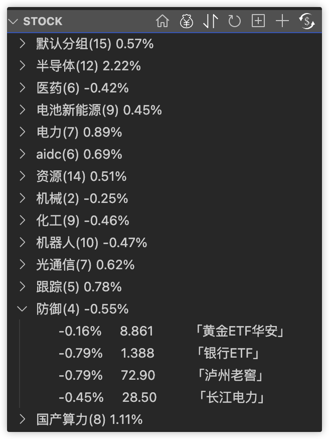

<div align="center">


# leek-fund（韭菜盒子 - 增强版）

> **韭菜盒子**——VSCode 里也可以看股票 & 基金 & 期货实时数据，做最好用的投资插件。
> 
> Leek box - Monitor real-time data of stocks, funds, and futures in VSCode.

[](./LICENSE)
[](https://github.com/cronglu/leek-fund/releases)
[](https://esbuild.github.io/)

投资有风险，入市需谨慎！

</div>

> 💡 **项目说明**：  
> 本项目基于优秀开源项目 [LeekHub/leek-fund](https://github.com/LeekHub/leek-fund)（原作者：[@giscafer](https://github.com/giscafer)）二次开发维护。因部分定制化刚需特性原仓库未采纳合入，特建立此独立分支维护并持续优化。衷心感谢原作者及所有开源社区贡献者的杰出工作！

---

## 🚀 二开增强特性 (Enhanced Features)

相比原版，本项目针对日常看盘的**股票分组交互**、**数据稳定性**和**运行性能**进行了深度优化：

1. 📊 **股票分组平均涨幅显示**  
   - 在每个股票分组标题旁直接展示该分组内所有持仓/关注股票的**综合平均涨跌幅**，行业板块或自选组合的强弱走势一览无余。
2. 🔄 **分组内股票拖拽排序与移动（Drag & Drop）**  
   - 深度适配 VS Code TreeView 原生拖拽能力，支持直接鼠标拖拽调整股票排序或跨分组自由移动，操作更顺手直观。
3. 🛡️ **自动创建并维护「默认分组」与容错兜底**  
   - 确保「默认分组」始终存在，新增自选股票默认自动归入默认分组；彻底修复初始化与版本更新时可能出现的股票分组丢失异常。
4. ⚡ **折叠分组智能刷新与性能控制**  
   - 增加折叠分组同步刷新机制，支持通过配置项 `leek-fund.groupForceRefreshInterval` 自定义刷新间隔，仅在需要时触发同步，显著降低后台接口轮询开销。
5. 📦 **构建体系升级（集成 esbuild）**  
   - 采用现代构建工具 `esbuild` 替代传统打包方式，大幅缩减扩展包 `.vsix` 体积，降低内存占用并大幅加快插件冷启动速度。

---

## 📦 安装与使用 (Installation)

### 方式一：下载 VSIX 离线包安装（推荐）
1. 前往本仓库 [Releases 页面](https://github.com/cronglu/leek-fund/releases) 下载最新版本的 `.vsix` 文件。
2. 打开 VS Code，按下快捷键 `Ctrl+Shift+P`（Mac 为 `Cmd+Shift+P`），输入并执行：
   ```text
   Extensions: Install from VSIX...
   ```
3. 选择刚才下载的 `.vsix` 文件安装完成后重新加载 VS Code 即可。

### 方式二：本地源码编译安装
如果你希望自行从源码构建打包：
```bash
# 1. 克隆代码并安装依赖
git clone git@github.com:cronglu/leek-fund.git
cd leek-fund
yarn install

# 2. 编译打包
yarn bundle
yarn package # 生成 leek-fund-*.vsix 安装包
```

> 📌 **注**：如需安装原作者官方版本，请前往 [VSCode Marketplace (官方原版)](https://marketplace.visualstudio.com/items?itemName=giscafer.leek-fund) 进行安装。

---

## 📋 功能特性清单 (Base Features)

继承自原版核心特性：

- 基金实时涨跌，实时数据，支持海外基展示
- 股票实时涨跌，支持 A 股、港股、美股
- 期货实时涨跌，支持国内期货
- 底部状态栏信息
- 开市自动刷新，节假日关闭轮询
- 支持升序/降序排序、基金持仓金额升序/降序
- 基金实时走势图和历史走势图
- 基金排行榜与基金持仓信息
- 股市资金流向（沪深港通资金流向、北向资金、南向资金）
- 支持 GUI 操作新增&删除 基金 和 股票
- 通过 GUI 添加基金和股票时，支持模糊搜索匹配
- 支持 GUI 设置涨跌颜色、状态栏股票自定义等
- 雪球用户动态关注（雪球新闻）
- 自定义涨跌图标（吃面、吃肉、烤韭菜、烤肉、喝酒）
- 基金持仓金额设置（用于动态计算盈亏）
- 基金盈亏展示（根据实时基金涨跌情况动态实时计算盈亏）
- 支持维护持仓成本价，自动计算收益率
- 基金趋势统计图
- 基金支持分组展示
- 股票支持分组展示（A 股、港股、美股）
- 股票涨跌提醒设置
- 状态栏、侧栏支持自定义模板格式
- OUTPUT 面板支持选股宝异动快讯，金十资讯
- 数据中心>牛熊风向标数据、选股宝
- 外汇牌价
- 支持 AI Agent 分析

---

## ⚙️ 插件设置 (Settings)

除了插件原有的丰富配置外，本项目新增如下关键设置项：

| 配置项 | 类型 | 默认值 | 说明 |
| :--- | :--- | :--- | :--- |
| `leek-fund.groupForceRefreshInterval` | `number` | `10000` (ms) | 折叠股票分组的强制全量刷新间隔时间（毫秒） |

---

## 📖 参考文档与截图

- [韭菜盒子原版使用文档](https://github.com/LeekHub/leek-fund/issues/371)
- [知乎文章：VSCode 插件开发——韭菜盒子](https://zhuanlan.zhihu.com/p/166683895)




---

## 🐛 问题反馈 (Issues)

如果您在**本分支版本**的使用过程中遇到问题或有改进建议，欢迎提交 Issue 反馈：
- [cronglu/leek-fund Issues](https://github.com/cronglu/leek-fund/issues)

---

## 📄 开源许可 (License)

本项目遵循 [BSD-3-Clause License](./LICENSE)。  
- Copyright (c) 2020 Nicky <giscafer@outlook.com>  
- Copyright (c) 2026 cronglu
